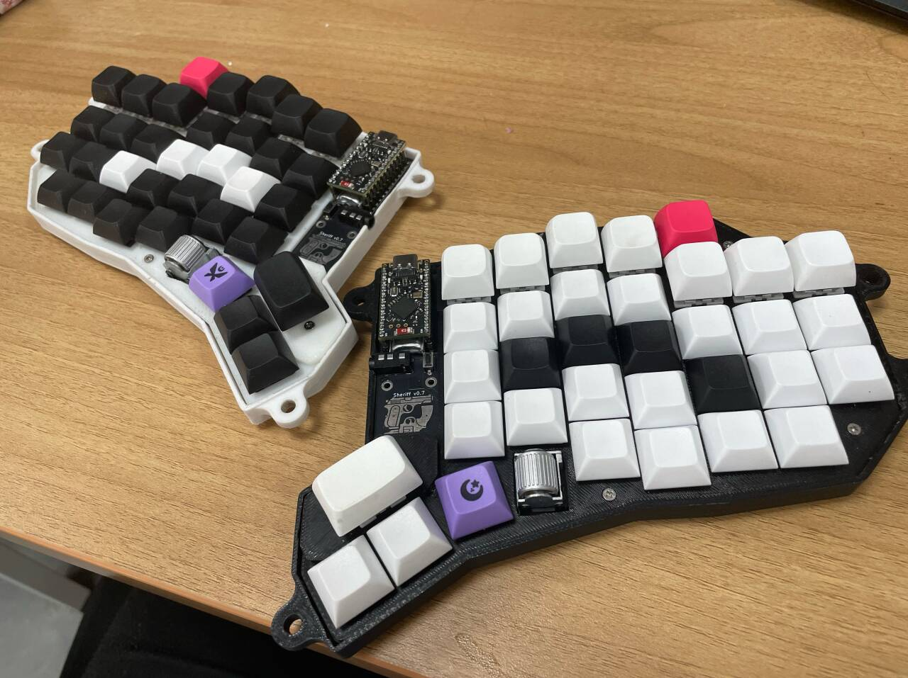
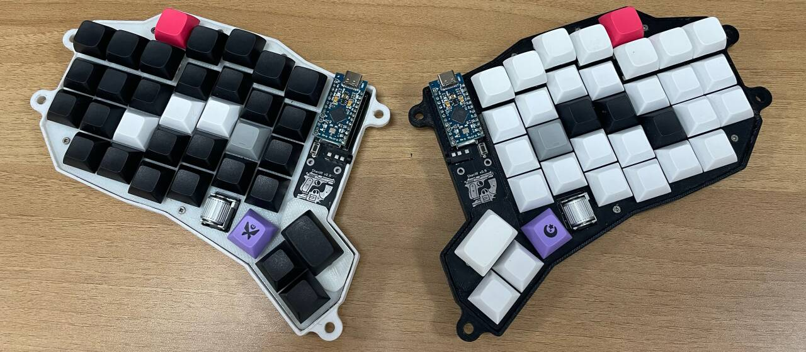
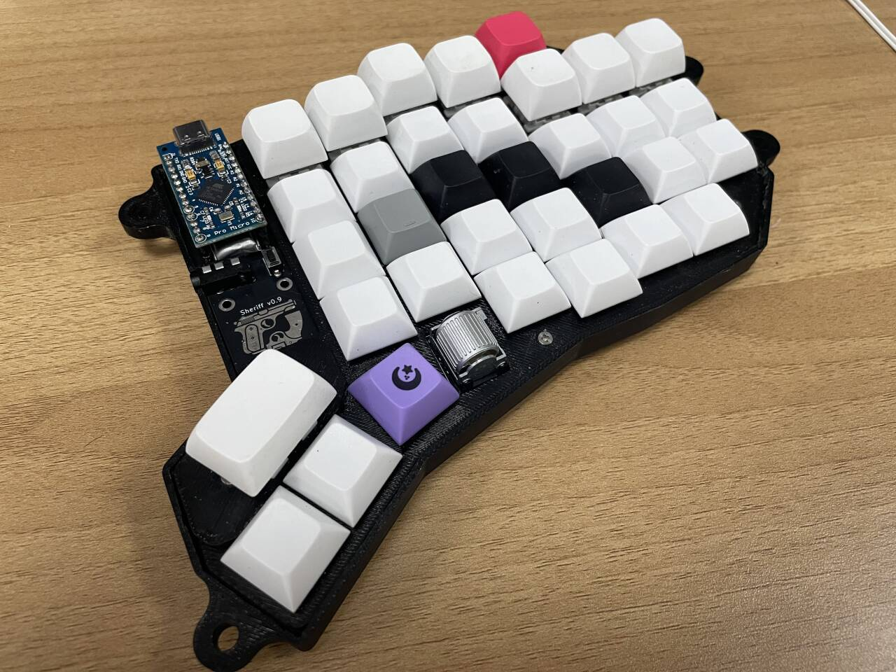
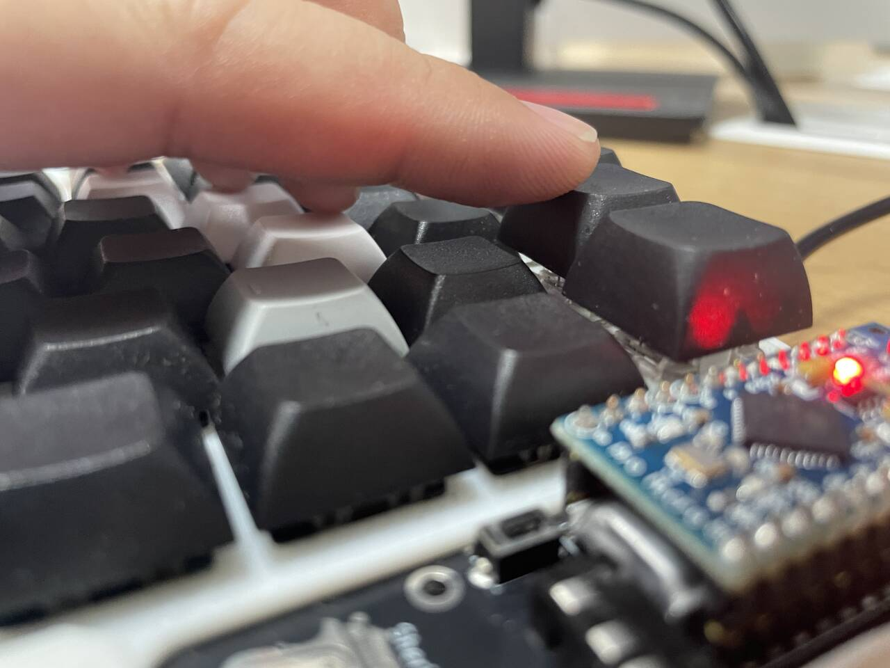

# :gun:Sheriff: A :fire:BLAZINGLY FAST:fire:, Feature-rich Ergonomic Split Keyboard with Thumb Scroll Wheels

- Double rotary encoder on the thumb cluster mapped to arrow keys by default, :fire:BLAZINGLY FAST:fire: for text editing
- Higher keys on the num row, easier to reach
- Similar layout to the more traditional keyboard on notebooks, less mental overload for switching between devices
- Reversible PCB
- Fully generated, including the case, allowing easy modifications
- Configurable case generation
- Both wired and wireless support
- Generated with [Ergogen](https://github.com/ergogen/ergogen)

## :art: Gallery

## :sparkles: Features

### Rotary Encoders

TODO: add demo gif

The core feature of the Sheriff is the easily accessible rotary encoders positioned on the thumb clusters.

#### Arrow keys

In the default layer, the encoder rotation steps are mapped to arrow keys, thus enabling easy, fast and precise cursor movements.

Moreover, If you press `8` while you scroll, each single encoder step will correspond to 8 arrow key taps, allowing for even faster movements.

#### Tab, delete and backspace

Since these keys often require continuous multiple presses as well, the encoder rotation steps are mapped to these keys as well.

Specifically:
- If you press `Tab` while scrolling, clockwise(rightwards) rotation will correspond to `Tab`, and counter-clockwise(leftwards) rotation will correspond to `Shift(Tab)`.
- If you press `Backspace` (left thumb cluster outer position) while scrolling, the clockwise(rightwards) rotation will correspond to `Delete`, and the counter-clockwise(leftwards) rotation will correspond to `Backspace`.

#### Arbitrary key repeats

You could also make the encoder repeat any other key you want. This behavior is enabled on the `Symbol` layer, activated by pressing `Esc` on the right thumb cluster outer position.

> [!NOTE]
> The ideal form of this function would be that one direction corresponds to a key press while the other direction corresponds to backspace, allowing for easy undoing. However, I haven't figured out how to implement this yet. PRs are welcome.

#### Mouse emulation
Mouse emulation via the rotary encoder is also available with the QMK firmware.

### Configurable case generation
The case is generated with [ergogen](https://github.com/ergogen/ergogen), and the config file was written with configurability in mind. There are multiple versions of the case, including `flat`, `tented`, `sinfle-sided tented` and `lifted tented`. The parameters are highly adjustable. See the `units` part of the [config file](./ergogen/config.yaml) for more details.

### Easier transitions

One of the motivations for this keyboard is to make the transition from a traditional keyboard to an ergonomic one easier. That's why the default layout is mostly the same as a traditional keyboard, with the only difference being the extra keys in thumb clusters. This way, when you switch back to a traditional keyboard and you reach for the thumb cluster mods, they are simply not there, eliminating any chance of pressing the wrong key.

### Higher up num row

The key caps on the num row are higher up, making them easier to reach.

### Both wired and wireless support
The PCB has both trrs jacks and battery pins, allowing for both wired and wireless connections.

Both ZMK(wireless) and QMK(wired) firmware are implemented; however, I've encountered several issues with the ZMK firmware, including:
- Two halves unable to pair(swapping boards did not help, neither did flashing reset firmware, and I'm 90% sure nothing's wrong with the firmware)
- Rotary encoder motions sometimes skipped

It's worth noting that I'm not using the official nice!nano boards, but rather the Pro Micro NRF52840 nice!nano v2 compatible boards, which might be the cause of the issues.

## Firmware
Supports wired usage with [QMK](https://qmk.fm/) firmware. Repository [here](https://github.com/AJGamma/sheriff-qmk-config)

Wireless usage is supported with [ZMK](https://zmk.dev/). Repository [here](https://github.com/AJGamma/sheriff-zmk-config). I couldn't get it to work properly though, detail [here](#both-wired-and-wireless-support).

## Layout
TODO

## :bulb: Inspirations

- [This amazing video by Christian Selig](https://www.youtube.com/watch?v=7UXsD7nSfDY) inspired me to build my own keyboard.
- I learned a lot from the [Corax](https://github.com/dnlbauer/corax-keyboard) keyboard, and borrowed some code as well.
- The [Arkenswoop](https://github.com/SuperFola/arkenswoop) keyboard has a similar scroll wheel feature, and I fixed my rotary encoder pin definition after checking its kicad file and the information from [this github repo](https://github.com/rroels/EVQWGD001-Pinout).

## Future work
- [ ] Screen
- [ ] LEDs
- [ ] More intuitive scroll wheel position and orientation
- [ ] New logo
- [ ] 3D-printed key caps
- [ ] More acquirable scroll wheel

