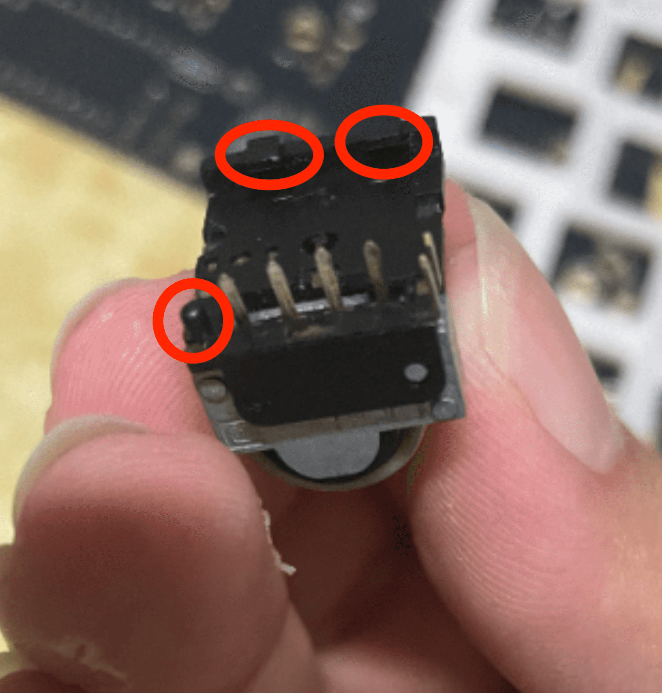
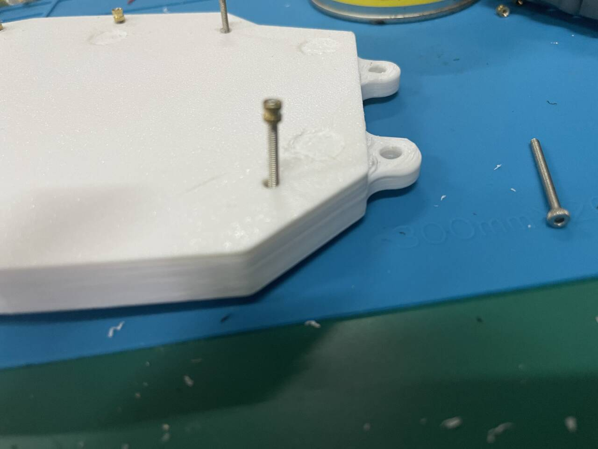

# Build guide

## TL;DR
- Make sure to connect the jumpers on the back side of each PCB (same side as where you solder the diodes and hot swap sockets)
- Case is mounted with M2*3.2 threaded screw inserts and M2 screws.
- This keyboard uses 18 MX switches and 50 Gateron ks-27 switches, and the diode directions are opposite for the two types of switches.
- See [this build guide of the Corax Keyboard for scroll wheel installation and modificaton](https://github.com/dnlbauer/corax-keyboard/blob/main/docs/BuildGuide.md) 
- My soldering order: jumpers → diodes → hot swap sockets → slider switch → reset button → TRRS jack → MCU pins → battery → encoder → MCU


## Parts list

Buying spare parts is recommended. Default values for `Wired` and `Wireless` are `Required`

| Name                                       | Quantity  | Wired        | Wireless | Notes                                                                                                                      |
|--------------------------------------------|-----------|--------------|----------|----------------------------------------------------------------------------------------------------------------------------|
| PCB                                        | 2         |              |          | Download the berber files from the release page; PCB thickness 1.6                                                         |
| Cases                                      | 1 of each |              |          | Download STL files from the release page; customization is possible, see [case customization](/docs/case_customization.md) |
| MX switches and hotswap sockets            | 18        |              |          |                                                                                                                            |
| Gateron ks-27 switches and hotswap sockets | 50        |              |          |                                                                                                                            |
| EVQWGD001 encoders                         | 2         |              |          |                                                                                                                            |
| SOD-123 diodes                             | 70        |              |          | I use the `1N4148W` diodes                                                                                                 |
| 1u key caps                                | 66        |              |          | I use DSA caps for ks-27 switches and XDA caps for MX switches, to create a larger height difference                       |
| 1.5u key caps                              | 2         |              |          | I use XDA caps                                                                                                             |
| M2*3*3.2 threaded screw inserts            | 14        |              |          | you could use ones with different height                                                                                   |
| M2*8 screws                                | 4         |              |          |                                                                                                                            |
| M2*10 screws                               | 10        |              |          |                                                                                                                            |
| Nice!nano v2 boards                        | 2         | Not needed | Required | I don't think you can use them for wired version, since QMK doesn't support its MCU                                        |
| Pro Micro boards                           | 2         | Required     |Not needed|                                                                                                                            |
| Reset Buttons                           |  2         |              |          |  I can't find the exact part number, the distance between pins is 6mm  |
| TRRS jacks | 2 | Required | Optional | Used for power transmission for wireless version |
| 3.5mm wires | 1 | Required | Optional | Make sure to buy the ones with 4 rings! the ones with 3 won't work and may ruin your boards! |
| 3.7V lithium batteries | 2 | Not needed | Required | I use 6*12*30mm ones |
| Slider switches | 2 | Not needed | Required | K3-1296S-E1 and MK-12C02-G015 both work |
| 12-pin 2.54mm pins and sockets | 4 |  |  | Sockets are highly recommended especially if you use Pro Micro ATMEGA32U4 boards |
| 11mm silicone footpads |  |  |  | Used for flat cases |
| M5 screws | 8 |  |  | Used for tented cases, determine lengths yourself |
| M5 nuts | 16 |  |  | For tented cases |
| 7.7mm silicone rubber round caps |  |  |  | For tented cases |


## Step By Step


### 1. Connect jumpers on the back side of the PCBs

There are 9 jumpers on each side. Connect the ones on the **back** side of the PCBs, that is, on the same side as the diodes and hot swap sockets. They are positioned near the MCU and the scroll wheel.


(The image shows 10 jumpers, that is because this is the 0.7 version and one of the jumpers were wrongly placed. The release version does not have such issue.)

### 2. Solder diodes
Make sure you solder them in the right directions. The little line on the diode should be on the same side as the line on the silk:
```raw
   ┌───────┬──┐                                               
   ┤Diode  │  ├                                               
   └───────┴──┘                                               
     │╲  │                                                    
    ─┤ 〉├─ Silk                                              
     │╱  │                                                   
```


### 3. Solder hot swap sockets

### 4. Solder slider switch, reset button and trrs jack

The switch should be on the **front** side of the PCB. This is the only part which you do need to solder on the front side. The reset button and trrs jack are placed on the front side but soldered on the back side.


### 5. Solder MCU pins

Place the MCU pins on the front side, use tape or an actual MCU(no need to be soldered) to hold them in place, then solder the pins on the back side.

### 6. Solder battery
Place the battery on the front side of the PCB, then solder the wires on the back.


Eventually your MCU, slider and battery should look like this:


### 7. Solder encoders
Remove the little column near the pins (required) and crop the extrusion on the other end (optional but recommended). Install and solder.




### 8. Install threaded screw inserts

Simply put, this is done by heating the inserts with a soldering iron and pushing them into the holes on the case. However, if your 3D printer is not well-calibrated, there may be a size error and you holes won't perfectly align with the ones on the PCB. To address this problem, you can insert longer screws first through the holes, screw the inserts onto the screws, and then heat them & push/pull.


<br>


### 9. Assemble the case, install the switches and key caps


### 10. Install footpads/tenting screws

#### 10.1 Footpads
Because the footpad slots need supports, you may not get a very even surface for the footpads, and the double-sided tapes that come with the footpads may not work well. Remove the tapes and use glue instead.


#### 10.2 Tenting screws
Use M5 bolts and nuts to tent the case, and use silicone rubber caps for better grip.


### 11. Flash the firmware
See firmware repos.

### 12. Connect to your device
If you're using wired build, connect the two halves with a TRRS cable **with 4 rings**. Connect the left half to your device.
