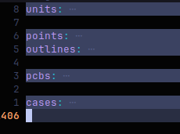

# Case Customization
I have written the [config](../ergogen/config.yaml) file with configurability in mind, and case customization can be easily done by following the instructions below.

## Step by Step

### 1. Modify the [config file](../ergogen/config.yaml)

Simple parameter modification can be done by changing the values in the `units` part of the config file. I have extracted most adjustable and customizable parameters to the `units` part of the config file, including wall thickness, screw diameter, tenting mount thickness, footpad diameter, etc. The variable names are pretty much self-explanatory. Modify the values to your liking.

More complex modifications can be done by modifying the `case` part of the config file. The names are pretty much self-explanatory as well.

### 2. Generate the jscad files
This can be done in two ways:


#### 2.1. Use the web-based deployments of ergogen

There are two online deployments of ergogen: the [official one](https://ergogen.xyz/) and the [unofficial one](https://ergogen.ceoloide.com/)

The online deployments of ergogen do not support uploading js footprint files, so you will receive a couple of error messages if you directly paste the config file into the input box. To avoid this, simply delete or comment out the `pcbs` part of the config file before copying. You can fold the yaml file to make it easier to read and alter.



The official one directly outputs stl files.

#### 2.2. Run ergogen locally
Install ergogen on your machine by following the instructions on the [ergogen docs](https://docs.ergogen.xyz/usage), then go to the ergogen directory and run the `ergogen` command:
```bash
git clone https://github.com/AJGamma/sheriff-keyboard
cd sheriff-keyboard/ergogen
ergogen .
```
The jscad files should be generated in the `ergogen/output/cases` directory.
<br>
<br>

You should get multiple files, among which you need two: the case file and switchplate file. There are multiple versions of the case, choose one that fits your needs.
### 3. Generate stl files
Use the [OpenJSCAD site](https://neorama.de/) to generate STL files.

### 4. Mirror the models
The generation only take care of the left side, and the right side is just a plain mirror of the left side. Nowadays most 3D-printer slicer software can easily mirror the models, so using a 3D modeling software to mirror the models isn't quite necessary. If you do need to do this, use blender, rhino or whatever. Some online tools may also work.


